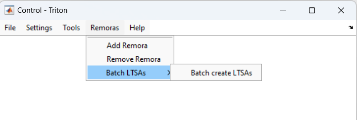

[**HOME**](Home) > **REMORAS** > [**BATCH LTSA**](batch-ltsa)

The Batch LTSA Remora can be used to generate long-term spectral averages (LTSAs) for multiple directories of sound files at once. It can be used to make LTSAs from XWAV, WAV, or FLAC files, can be used on single or multichannel data, and allows for unique LTSA settings for each directory to be processed. 

1. <a href="#SH1">**Installation**</a>
1. <a href="#SH2">**Remora: Batch LTSA**</a>
   * <a href="#SH2a">**Step 1: Define initial LTSA settings**</a>
   * <a href="#SH2b">**Step 2: Check settings for each directory**</a>
   * <a href="#SH2c">**Step 3: Check output filenames for each LTSA**</a>
   * <a href="#SH2d">**Step 4: Create LTSAs**</a>
1. <a href="#SH3">**General use and debugging notes**</a>

<a name='SH1'/>

# Installation

* Start Triton
* Select Remoras/ Add Remora - choose the BatchLTSA folder to install
* Triton needs to be restarted

<a name='SH2'/>

# REMORA: Batch LTSA

The pulldown menu for REMORA batchLTSA has one option - 'Batch create LTSAs'

<a name='SH2a'/>

### Step 1: Define initial LTSA settings

The Batch LTSA set up GUI/window allows the user to choose the directory to process and define some inital settings:

* Set the 'Input Folder' to the directory containing subdirectories of audio files to be processed (e.g., a the input folder may be for a cruise or site and contain multiple subdirectories of individual recorder deployments)
* Set the 'Data File Type' to XWAV, WAV, or FLAC
* Set the time average ('tave') and frequency average ('dfreq'). This will be the default for all directories but can be changed later at the individual directory level
* Specify the 'Number of channels' as either single or multichannel. This must be the same for all directories
* Set the 'Channel to process' to specify which channels to create LTSAs for. If it is single channel data, leave this set to 1. If it is multichannel data, either specify a single channel or set to 0 to create LTSAs for every channel
* Hit 'Batch Create LTSAs'

<a name='SH2b'/>

### Step 2: Check settings for each directory

A second window will pop up where the user can check the time and frequency average settings and channel for each directory individually. 

* `tave`, `dfreq`, and `ch` can be manually changed to use different settings for each directory (e.g., one directory is of decimated data so requires different frequency averaging)
* Directories can be skipped by setting any one (or all) of the settings to blank/empty for that directory
* For multichannel data, setting the channel to `0` will create LTSAs for all channels

<a name='SH2c'/>

### Step 3: Check output filenames for each LTSA

A third window will popup that displays the assembled output filenames for each LTSA (to be saved in the same directory as the sound files). These use each directory name as the prefix and include the time and frequency average settings. If it is multichannel data it will also include the channel number. Each filename can be manually edited. 

After hitting 'Okay', if any of the specified filenames already exist, the user will be given the option to 'Overwrite', 'Continue, don't overwrite', or 'Skip' that file. If 'Continue, don't overwrite' is selected `_copy` will just be appended to the filename and a new LTSA will be created. 

<a name='SH2d'/>

### Step 4: Create LTSAs

LTSAs will now be created. A progress bar indicates progress for each directory's LTSA and the counter at the top of the progress bar indicates which of the LTSAs is actively being made. If creating LTSAs for all channels of multichannel data, that will be tracked by a single progress bar for that directory since each slice for each channel will be calculated simultaneously.

<a name='SH3'/>

#### General use and debugging notes

* Instructions and warnings are printed to the Triton Message Window
* Create an issue on the Triton GitHub repository and tag @sfregosi for help

